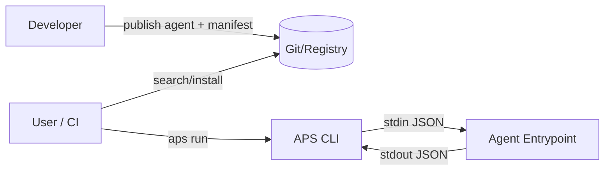
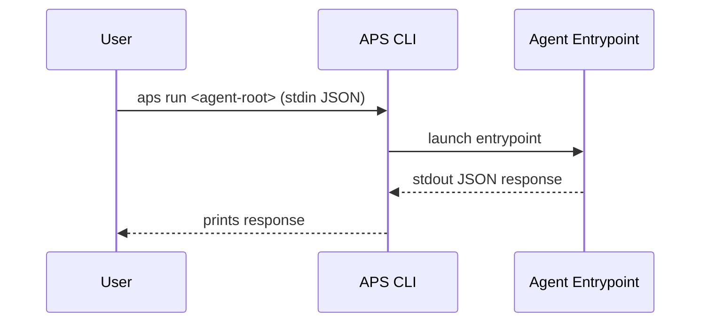

# APS Architecture (draft)

APS defines a portable way to package agents with a manifest and a runtime contract.

## High-level



```mermaid
graph TD
  A[agent-root] --> B[aps/agent.yaml]
  A --> C[src/...]
  A --> D[assets/models (optional)]
  A --> E[README.md]
```

