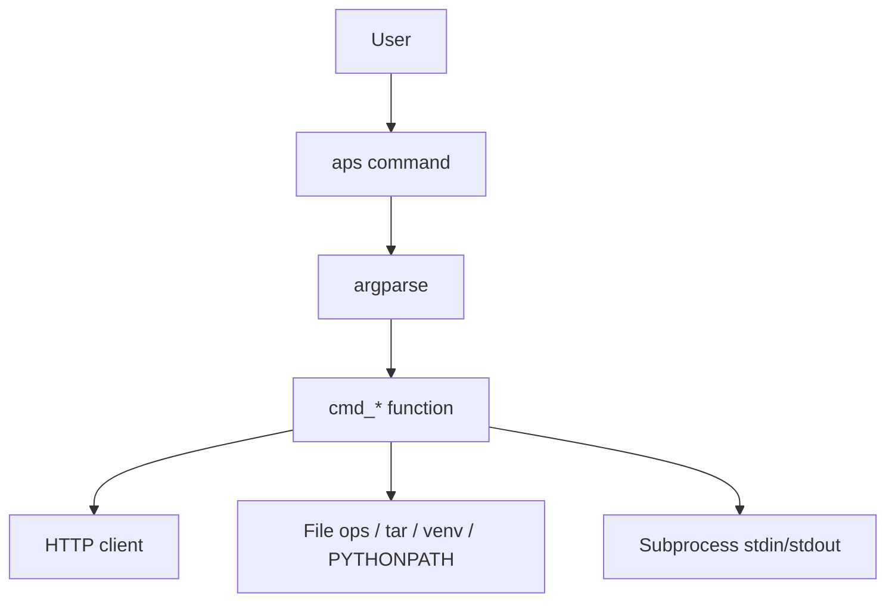
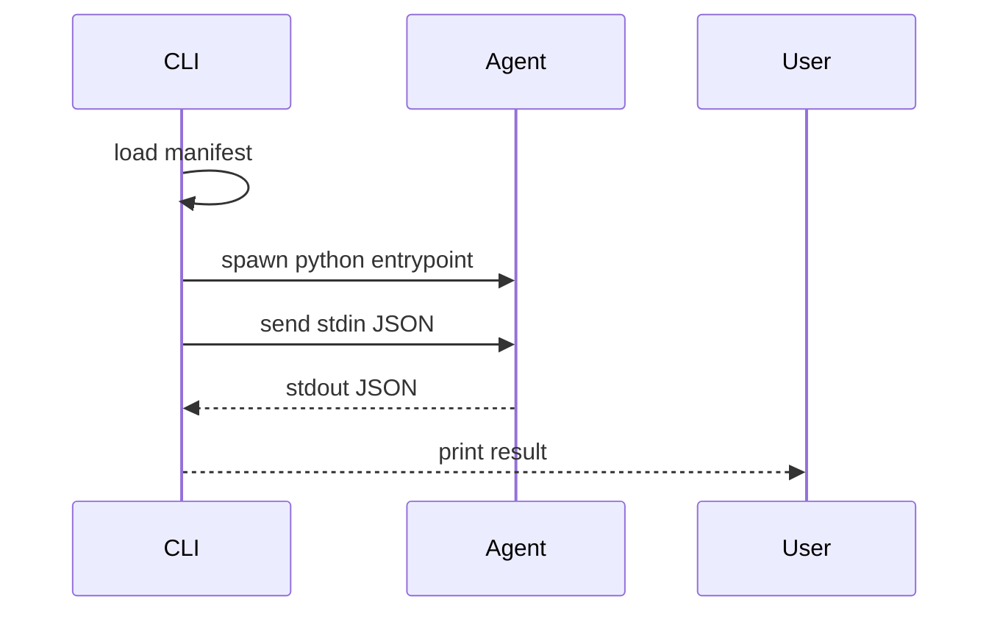
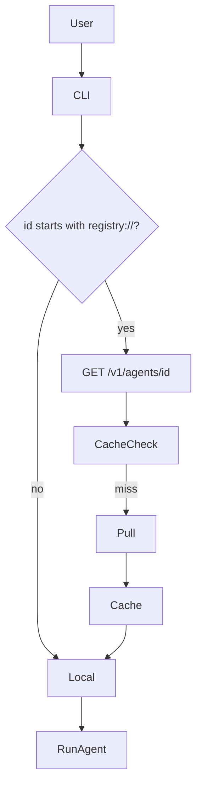

# APS CLI Developer Guide

This guide explains APS CLI internals, command structure, execution flow, and how to extend or debug the CLI.

APS CLI = reference implementation of the APS packaging + runtime spec.

> Goal: make the CLI simple, hackable, Unix-style, and portable.

---

## 🧠 CLI Philosophy

| Principle | Description |
|---|---|
Simple first | Always start with minimal functionality  
Predictable | No magic — explicit inputs/outputs  
Unix style | JSON stdin → program → JSON stdout  
Portable | Works offline, local-first, OS-agnostic  
Spec-driven | CLI validates the APS standard  

---

## 📦 CLI Code Overview
```
cli/
└── src/aps_cli/
├── app.py ← entrypoint + command handlers
├── manifest.py ← load + validate agent.yaml
├── cache.py ← local agent cache
├── utils.py
└── init.py
```


Entrypoint installed as `aps` binary.

---

## 🧬 CLI Architecture



## Command Map
| Command               | Purpose                               |
| --------------------- | ------------------------------------- |
| `aps run <path>`      | Execute agent from folder or registry |
| `aps build <src>`     | Create `.aps.tar.gz` package          |
| `aps publish <file>`  | Upload to registry                    |
| `aps pull <id>`       | Download + cache agent                |
| `aps validate <path>` | Validate manifest & layout            |
| `aps registry serve`  | Start local registry                  |

Future:

    - aps login

    - aps search <term>

    - aps config

    - aps sign / verify

## Run Flow (local)


Key runtime logic in cmd_run_sync() + _wrap_request().

## Run Flow (registry)


Helper function: _resolve_registry_path_if_needed()

## Test Structure

    - Unit-level tests under cli/tests/

    - Fake registry calls via monkeypatch

    - No external network calls allowed

Run:
```bash
pytest -q
```

## Key Functions
| File                               | Function                   | Purpose             |
| ---------------------------------- | -------------------------- | ------------------- |
| `app.py`                           | `cmd_run_sync`             | Run agent (local)   |
| `cmd_run_stream`                   | Streaming run mode         |                     |
| `cmd_build`                        | Package agent              |                     |
| `cmd_publish`                      | Upload tar.gz              |                     |
| `cmd_pull`                         | Fetch to cache             |                     |
| `_resolve_registry_path_if_needed` | Translate registry:// URIs |                     |
| `manifest.py`                      | `load_manifest`            | Validate agent.yaml |
| `cache.py`                         | `cached_agent_dir`         | Return cache path   |


## Subprocess Behavior

    - Agents are run as external processes, not imported modules

    - PYTHONPATH is auto-set to agent src/

    - Both stdout and stderr captured

    - Streaming mode reads line-by-line and detects final JSON

## Adding a New Command

    - Add argparse stanza in main()

    - Write handler cmd_xxx(args)

    - Unit test in cli/tests/test_xxx.py

    - Update docs

```bash
def cmd_hello(args):
    print("hello world")

# inside parser block
s = subparsers.add_parser("hello")
s.set_defaults(func=cmd_hello)
```

## Debugging Tips
### Enable debug logs

```bash
export APS_DEBUG=1
```

## Log process IO

Use print statements or sys.stderr.write() inside helpers.

## Manual resolve test
```bash
python3 -c "import aps_cli.app as a;print(a._resolve_registry_path_if_needed('registry://dev.echo'))"
```

## Roadmap Hooks

Placeholders in CLI for future:

    - Signature validation

    - Agent attestation

    - Capability metadata

    - Remote run orchestration

    - Lifecycle hooks (prepare, cleanup)

    - Config file ~/.aps/config

## Done — You're Now Able to Modify the CLI

Next: see docs/testing.md for test conventions and CI rules.

