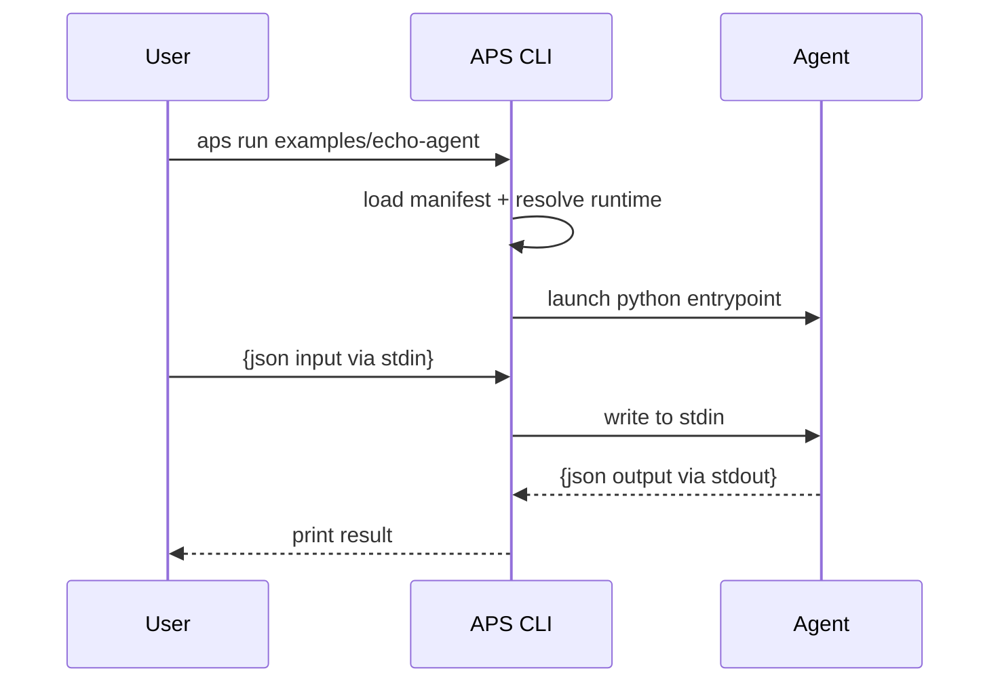

Audience: contributors who want to modify APS internals
Goal: teach anyone how APS works under the hood in ~15 minutes

# APS Hacking Guide

This guide explains how the APS CLI, manifest system, agent runtime, and registry work internally.  
It is for contributors modifying APS core — not just using it.

---

## 🧠 Core Concepts

APS = **Agent Packaging Standard**

It defines:

| Plane | What it does |
|---|---|
Spec | YAML manifest, runtime contract, agent metadata
CLI | Build, validate, publish, run, pull, search
Registry | Publish + discovery API (local or cloud)
SDK | Helpers for writing agents
Examples | Reference agents (echo, RAG, etc.)

APS philosophy:

- Start minimal, evolve with community
- CLI + spec = reference implementation
- Registry MUST remain portable
- Agents MUST run **locally** & **offline**
- Runtime IO = **JSON stdin/stdout** (Unix philosophy)

---

## 📂 Code Layout Overview

root/
├── cli/
│ └── src/aps_cli/
│ ├── app.py ← main CLI logic
│ ├── manifest.py ← load/validate agent.yaml
│ ├── cache.py ← ~/.aps/cache/<id>/<ver>
│ └── utils.py
│
├── registry/
│ └── src/aps_registry/
│ ├── server.py ← FastAPI registry server
│ └── store.py ← SQLite index + tar storage
│
├── specs/ ← Standard docs
└── examples/

---

## ⚙️ CLI Flow

### ✅ `aps run <path>`

