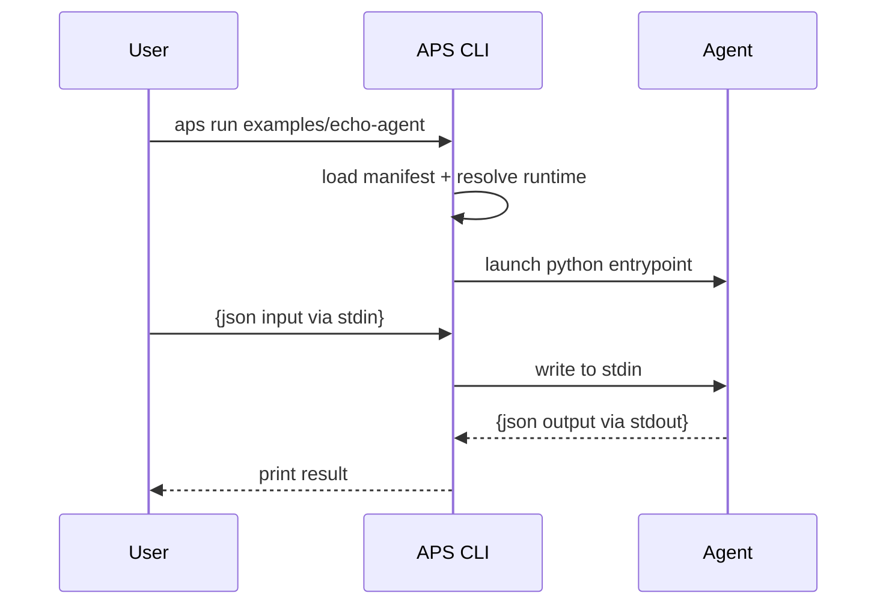

> **Audience:** contributors who want to modify APS internals
> **Goal:** teach anyone how APS works under the hood in ~15 minutes

# APS Hacking Guide

This guide explains how the APS CLI, manifest system, agent runtime, and registry work internally.  
It is for contributors modifying APS core — not just using it.

---

## 🧠 Core Concepts

APS = **Agent Packaging Standard**

It defines:

| Plane | What it does |
|---|---|
Spec | YAML manifest, runtime contract, agent metadata
CLI | Build, validate, publish, run, pull, search
Registry | Publish + discovery API (local or cloud)
SDK | Helpers for writing agents
Examples | Reference agents (echo, RAG, etc.)

APS philosophy:

- Start minimal, evolve with community
- CLI + spec = reference implementation
- Registry MUST remain portable
- Agents MUST run **locally** & **offline**
- Runtime IO = **JSON stdin/stdout** (Unix philosophy)

---

## 📂 Code Layout Overview
```
root/
├── cli/
│ └── src/aps_cli/
│ ├── app.py ← main CLI logic
│ ├── manifest.py ← load/validate agent.yaml
│ ├── cache.py ← ~/.aps/cache/<id>/<ver>
│ └── utils.py
│
├── registry/
│ └── src/aps_registry/
│ ├── server.py ← FastAPI registry server
│ └── store.py ← SQLite index + tar storage
│
├── docs/specs/ ← Standard docs
└── examples/
```

---

## ⚙️ CLI Flow

### ✅ `aps run <path>`


Runtime contract = JSON → JSON pipeline

## Registry resolution logic
| Input           | Resolution                                       |
| --------------- | ------------------------------------------------ |
| local path      | use agent directory as-is                        |
| `registry://id` | → lookup version → cache → pull if missing → run |

Cache layout:

```bash
~/.aps/cache/<agent_id>/<version>/
```

## Key Functions to Know
| File                               | Function                 | Purpose              |
| ---------------------------------- | ------------------------ | -------------------- |
| `app.py`                           | `cmd_run`                | run agent            |
| `cmd_build`                        | tar up agent             |                      |
| `cmd_publish`                      | post to registry         |                      |
| `_resolve_registry_path_if_needed` | fetch/pull agent         |                      |
| `manifest.py`                      | `load_manifest`          | read agent.yaml      |
| `store.py`                         | `publish/archive/search` | store & index agents |

## Gotchas
| Issue            | Notes                                |
| ---------------- | ------------------------------------ |
| Python paths     | We set `PYTHONPATH` to `src/`        |
| Registry threads | SQLite needs thread-safe access      |
| Stdio contract   | Agents must flush stdout             |
| Streaming mode   | Reads lines until final JSON message |

## Debugging Tips
### Log internal ops
```bash
export APS_DEBUG=1
```

TODO: structured debug logs coming soon.

### View registry DB
```bash
sqlite3 registry_data/index.db '.tables'
```

### View pulled agents
```bash
ls ~/.aps/cache
```

## Test Philosophy

APS tests must be:

  - Fast

  - Deterministic

  - No real network calls

  - Fake registry I/O accepted

  - Always test:

    - manifest parsing

    - tar creation & extraction

    - registry resolution

    - stdout JSON contract

Run tests:
``bash
pytest -q
```

## Future Extensibility Hooks

We will evolve toward:

  - Cryptographic signing & attestation

  - Managed remote runtimes (optional)

  - Build matrix (Python, Node, WASM)

  - OCI / oras compatibility

  - SBOM + supply chain metadata

  - Streaming + cancelation control

  - FFI isolation (security profiles)

## Done — you are now dangerous in the APS codebase

Next: hack on a command or registry feature