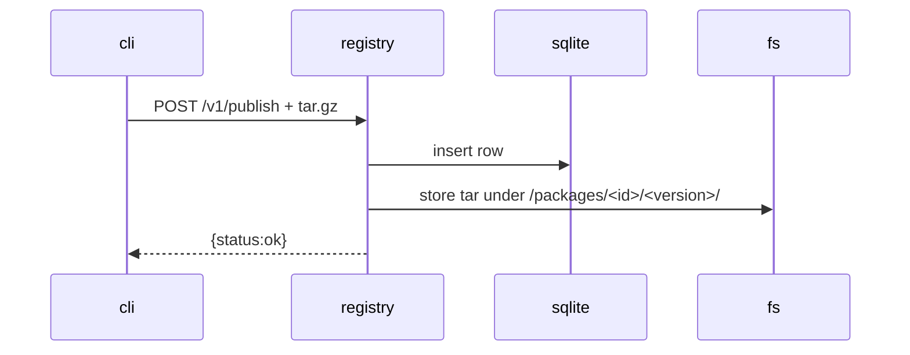
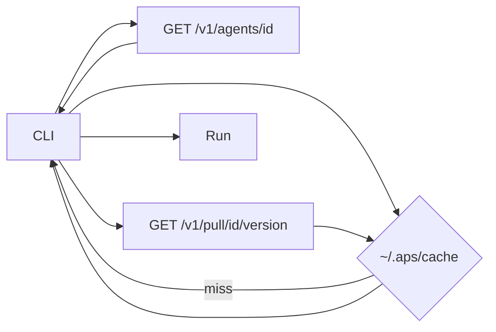

# APS Registry Developer Guide

This document explains how the APS registry works, how to run it in development mode, how agents are stored/indexed, and how to debug issues.

The APS Registry is intentionally minimal and local-first — designed to scale from **laptop → enterprise registry → cloud marketplace**.

---

## 🎯 Goals of the APS Registry

- Store agent packages (`.aps.tar.gz`)
- Index agent metadata (id, version, summary, tags)
- Serve agent metadata and package blobs
- Local-only, portable, works offline
- Mirrors **pip + OCI registry** concepts, but agent-first

Future registry modes:
- 🔒 Signed agents
- 🔄 Replication & syncing
- 🌐 Multi-tenant hosted APS Hub
- 📦 OCI backend (oras plugin)

---

## 📦 How It Works

### Commands

| Action | CLI | API |
|---|---|---|
Start registry | `aps registry serve` | — |
Publish agent | `aps publish pkg.tar.gz` | `POST /v1/publish` |
Search | `aps search` (future) | `GET /v1/search?q=` |
Get agent info | auto-resolve in `aps run registry://id` | `GET /v1/agents/<id>` |
Pull | `aps pull id` | `GET /v1/pull/<id>/<ver>` |

---

## 🏗️ Internal Directory Layout

When running:

```bash
aps registry serve --root registry_data
```
Directory structure:
```
registry_data/
 ├── index.db                # SQLite DB for metadata
 └── packages/
      └── dev.echo/
          └── 0.0.1/
              └── agent.aps.tar.gz
```
SQLite schema (simple, extendable):
| Column   | Description           |
| -------- | --------------------- |
| id       | agent id (`dev.echo`) |
| version  | semver string         |
| summary  | text for search       |
| manifest | JSON blob             |

## Run the Registry (Dev Mode)
```bash
aps registry serve --root registry_data --port 8080
```
Logs appear automatically.

Stop server:
```bash
CTRL + C
```
> **Tip:** Registry is lightning-fast — run in a terminal and kill any time.

## Hitting REST API
### Publish
```bash
curl -F "file=@dist/dev.echo.aps.tar.gz" http://localhost:8080/v1/publish
```

### Search
```bash
curl "http://localhost:8080/v1/search?q=echo"
```
### Get agent metadata
```bash
curl "http://localhost:8080/v1/agents/dev.echo"
```
## Program Flow
### Publish

Resolve (on aps run registry://id)

## Debugging Tools
### View DB
```bash
sqlite3 registry_data/index.db ".tables"
sqlite3 registry_data/index.db "SELECT * FROM agents;"
```
### Inspect packages
```bash
tar -tf registry_data/packages/dev.echo/0.0.1/agent.aps.tar.gz
```

## Delete package index (soft reset)
```bash
rm -rf registry_data/index.db
```
## Common Troubleshooting
| Error                 | Fix                                    |
| --------------------- | -------------------------------------- |
| `sqlite thread error` | Restart server — SQLite thread model   |
| `multipart missing`   | `pip install python-multipart`         |
| `400 agent exists`    | bump version in `agent.yaml`           |
| Corrupt cache         | `rm -rf ~/.aps/cache/<id>`             |
| Agent not found       | ensure server is running & URL correct |

## Future Registry Features
    - ✅ SQLite local registry (now)

    - 🔧 Multi-registry config (~/.aps/config)

    - 📦 Remote registry (aps login)

    - 🔒 Signing & attestation

    - 🍱 OCI compatibility (later layer)

    - 🔁 Replication sync

    - 🎯 Search by tag/capability

    - 👥 org / namespace support

    - 💰 Monetization metadata (storefront phase)

    - 📊 Analytics hooks (opt-in)

## Done — you can now hack the APS registry

Next: see cli-dev.md to dive into CLI internals.